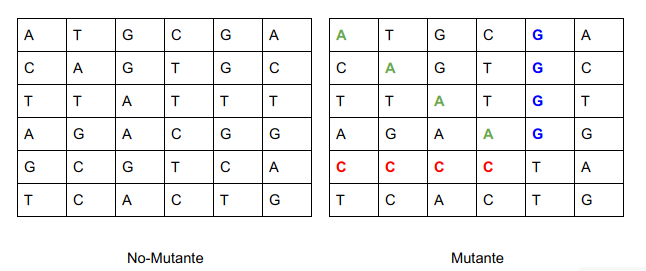
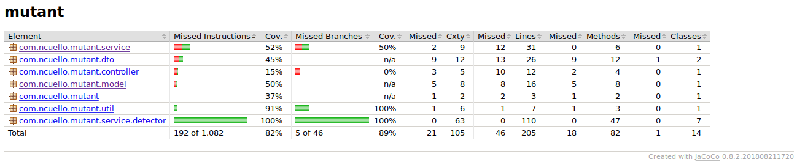

# Mutant

_Magneto quiere reclutar la mayor cantidad de mutantes para poder lucharcontra los X-Men.Te ha contratado a ti para que desarrolles un proyecto que detecte si unhumano es mutante basándose en su secuencia de ADN.Para eso te ha pedido crear un programa con un método o función con la siguiente firma (Enalguno de los siguiente lenguajes: Java / Golang / C-C++ / Javascript (node) / Python / Ruby):boolean isMutant(String[] dna);   // Ejemplo JavaEn donde recibirás como parámetro un array de Strings que representan cada fila de una tablade (NxN) con la secuencia del ADN. Las letras de los Strings solo pueden ser: (A,T,C,G), lascuales representa cada base nitrogenada del ADN._



_Sabrás si un humano es mutante, si encuentras **más de una secuencia de cuatro letras iguales**, de forma oblicua, horizontal o vertical._

_**Ejemplo (Caso mutante):**  
String[] dna = {"ATGCGA","CAGTGC","TTATGT","AGAAGG","CCCCTA","TCACTG"};En este caso el llamado a la función isMutant(dna) devuelve “true”.Desarrolla el algoritmo de la manera más eficiente posible._

_**Desafíos:**_

_**Nivel 1:**
Programa (en cualquier lenguaje de programación) que cumpla con el método pedido porMagneto._

_**Nivel 2:**
Crear una API REST, hostear esa API en un cloud computing libre (Google App Engine,Amazon AWS, etc), crear el servicio “/mutant/” en donde se pueda detectar si un humano esmutante enviando la secuencia de ADN mediante un HTTP POST con un Json el cual tenga elsiguiente formato:
POST → /mutant/
{
“dna”:["ATGCGA","CAGTGC","TTATGT","AGAAGG","CCCCTA","TCACTG"]
}_

_En caso de verificar un mutante, debería devolver un HTTP 200-OK, en caso contrario un 403-Forbidden_

_**Nivel 3:**
Anexar una base de datos, la cual guarde los ADN’s verificados con la API.Solo 1 registro por ADN.
Exponer un servicio extra “/stats” que devuelva un Json con las estadísticas de lasverificaciones de ADN: {“count_mutant_dna”:40, “count_human_dna”:100: “ratio”:0.4}_

_Tener en cuenta que la API puede recibir fluctuaciones agresivas de tráfico (Entre 100 y 1millón de peticiones por segundo)._

_Test-Automáticos, Code coverage > 80%._

_**Entregar:**_

_*Código Fuente (Para Nivel 2 y 3: En repositorio github)._
_*Instrucciones de cómo ejecutar el programa o la API. (Para Nivel 2 y 3: En README degithub)._
_*URL de la API (Nivel 2 y 3)._

## Comenzando 🚀

_Estas instrucciones te permitirán obtener una copia del proyecto en funcionamiento en tu máquina local para propósitos de desarrollo y pruebas._

Mira **Deployment** para conocer como desplegar el proyecto.


### Pre-requisitos 📋

_Es necesario contar con la JDK8._

_Además se debe contar con una instancia de MySQL8 local y tener un schema llamado mutant.
En caso de no tenerlo, para pruebas locales se debe comentar las propiedades de Base de Datos que se encuentran en **application.properties.**_

```
spring.application.name=service-mutant
server.port=8090

#spring.datasource.url=jdbc:mysql://localhost:3306/mutant
#spring.datasource.username=root
#spring.datasource.password=password
#spring.datasource.driver-class-name=com.mysql.cj.jdbc.Driver
#spring.jpa.database-platform=org.hibernate.dialect.MySQL8Dialect
#spring.jpa.hibernate.ddl-auto=update
```

_Y además descomentar en **pom.xml** el siguiente fragmento:_


```
<!-- 		<dependency> -->
<!-- 			<groupId>com.h2database</groupId> -->
<!-- 			<artifactId>h2</artifactId> -->
<!-- 			<scope>runtime</scope> -->
<!-- 		</dependency> -->
```

_De ese modo se utilizará una base en memoria._


### Instalación 🔧

_Una vez clonado el repositorio, se debe ejecutar el siguiente comando en la raíz del proyecto:_

```
./mvn install
```

_En la carpeta /target se creará un .jar llamado **mutant-0.0.1-SNAPSHOT.jar**._

_Situados en /target ejecutaremos el siguiente comando para levantar la aplicación localmente:_

```
java -jar mutant-0.0.1-SNAPSHOT.jar
```

_De ese modo ya estará disponible el servicio para usarlo._

_**El puerto que se debe utilizar es el 8090.**_

## Servicios

_**Local:** localhost:8090_

_**GCloud:** https://mutant-meli.rj.r.appspot.com_

_**Ejemplos:**_

_1) POST → /mutant/_

_**Local**:_ localhost:8090/mutant_

_**GCloud:**_ https://mutant-meli.rj.r.appspot.com/mutant_

_**Request Body**_
```
{
“dna”:["ATGCGA","CAGTGC","TTATGT","AGAAGG","CCCCTA","TCACTG"]
}_
```

_**Response**_
```
200 OK
```


_2) GET → /stats/_

_**Local**:_ localhost:8090/stats_

_**GCloud:**_ https://mutant-meli.rj.r.appspot.com/stats_

_**Response**_
```
200 OK

{
    "ratio": 0.6,
    "count_mutant_dna": 3,
    "count_human_dna": 5
}
```


## Ejecutando las pruebas ⚙️

_Para realizar las pruebas utilicé JUnit._

_Utilicé JaCoCo para la métrica de los tests._

_Para verificar la métrica debe ejecutarse lo siguiente en la raíz del proyecto:_

```
./mvnw jacoco:report
```

_El goal anterior creará un directorio dentro de el directorio target llamado site dentro de este veremos otro folder llamado jacoco y dentro de el un archivo llamado index.html que al abrirlo se verá como se muestra a continuación:_




## Construido con 🛠️

* JDK8
* Maven
* MySQL
* H2
* JUnit
* Jacoco

## Balanceo de carga

Con GCloud se pueden instanciar varios servicios y hará el balanceo de carga automáticamente.

Pero como extra, cree una branch nueva **balanceador**, donde lo hago "manualmente"... 
En el README.MD de esa branch hay más detalles.
